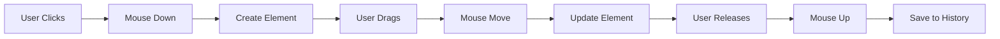

# 🎨 Interactive Whiteboard Application

A modern, feature-rich whiteboard application built with React that enables digital drawing, sketching, and collaboration. Create diagrams, sketches, and visual content with an intuitive interface and professional-grade drawing tools.

Live Link :  https://my-whiteboard-beta.vercel.app/


## ✨ Features

### 🎯 Drawing Tools
- **🖌️ Brush** - Smooth freehand drawing with pressure simulation
- **📏 Line** - Perfect straight lines with adjustable thickness
- **▭ Rectangle** - Geometric rectangles with stroke and fill options
- **⭕ Circle** - Circles and ellipses with customizable styling
- **➡️ Arrow** - Directional arrows with professional arrowheads
- **🧹 Eraser** - Intelligent element removal with proximity detection
- **🔤 Text** - Rich text annotations with custom fonts and sizes

### 🎨 Customization
- **Color Palette** - Predefined colors plus custom color picker
- **Stroke & Fill** - Independent control over outline and interior colors
- **Size Control** - Adjustable brush sizes, line thickness, and font sizes
- **Visual Feedback** - Real-time preview while drawing

### 💫 User Experience
- **↶ Undo/Redo** - Complete history management with keyboard shortcuts
- **💾 Export** - Download artwork as high-quality PNG images
- **⌨️ Keyboard Shortcuts** - `Ctrl+Z` (undo), `Ctrl+Y` (redo)
- **📱 Responsive** - Optimized for desktop and tablet use
- **🎭 Hand-drawn Style** - Natural, sketchy appearance using RoughJS

## 🚀 Quick Start

### Prerequisites
- Node.js 14+ 
- npm or yarn

### Installation

```bash
# Clone the repository
git clone https://github.com/AmitIITGoa/my_whiteboard.git

# Navigate to project directory
cd whiteboard-app

# Install dependencies
npm install

# Start development server
npm start
```

The application will open at `http://localhost:3000`

### Build for Production

```bash
# Create optimized production build
npm run build

# Serve the build locally (optional)
npx serve -s build
```

## 🏗️ Architecture Overview

### Technology Stack

| Component | Technology | Purpose |
|-----------|------------|---------|
| **Frontend** | React 18.2.0 | Modern UI framework with hooks |
| **Styling** | Tailwind CSS 3.3.6 | Utility-first CSS framework |
| **Drawing** | RoughJS 4.6.6 | Hand-drawn, sketchy graphics |
| **Brush Engine** | Perfect Freehand 1.2.0 | Smooth freehand strokes |
| **State** | Context + useReducer | Predictable state management |
| **Canvas** | HTML5 Canvas API | High-performance rendering |

### Project Structure

```
src/
├── 📁 components/           # React components
│   ├── 🎨 Board/           # Main canvas component
│   ├── 🛠️ Toolbar/         # Tool selection bar
│   └── ⚙️ Toolbox/         # Tool customization panel
├── 📦 store/               # State management
│   ├── BoardProvider.js    # Drawing state & actions
│   ├── ToolboxProvider.js  # Tool settings & properties
│   ├── board-context.js    # Board context definition
│   └── toolbox-context.js  # Toolbox context definition
├── 🔧 utils/               # Helper functions
│   ├── element.js          # Element creation & detection
│   └── math.js             # Geometric calculations
├── 📋 constants.js         # Application constants
├── 🏠 App.js              # Root component
└── 🚀 index.js            # Application entry point
```

## 🎯 How It Works

### Drawing Process Flow



### State Management Pattern

```javascript
// Example: Drawing a rectangle
User clicks rectangle tool
    ↓
Toolbar → changeToolHandler(TOOL_ITEMS.RECTANGLE)
    ↓
BoardProvider → CHANGE_TOOL action
    ↓
State updates → activeToolItem = "RECTANGLE"
    ↓
Components re-render → Toolbox shows rectangle options
```

## 🔧 Key Components

### `Board` - Main Canvas
- Renders HTML5 canvas with full window dimensions
- Handles mouse events (down, move, up)
- Real-time element rendering using RoughJS and Canvas API
- Text input overlay management
- Keyboard shortcut implementation

### `Toolbar` - Tool Selection
- Interactive tool buttons with active state indication
- Undo/Redo functionality
- Canvas download feature
- Responsive icon layout

### `Toolbox` - Tool Customization
- Dynamic UI based on selected tool
- Color picker with predefined palette
- Size controls with appropriate ranges
- Real-time property updates

## 🎨 Drawing Tools Deep Dive

### Brush Tool
```javascript
// Utilizes perfect-freehand for natural stroke simulation
const stroke = getStroke(points, {
  size: 16,
  thinning: 0.5,
  smoothing: 0.5,
  streamline: 0.5,
});
```

### Shape Tools (Rectangle, Circle, Arrow)
- Built with RoughJS for hand-drawn aesthetic
- Support both stroke and fill colors
- Real-time size adjustment during drawing

### Text Tool
- Custom font rendering with Google Fonts
- Dynamic textarea overlay
- Integrated with canvas coordinate system

## ⚡ Performance Optimizations

- **Efficient Rendering**: `useLayoutEffect` prevents visual flicker
- **Smart Re-renders**: Context patterns minimize unnecessary updates
- **Event Handling**: Optimized mouse event processing
- **Memory Management**: Proper cleanup of event listeners and canvas contexts

## 🎯 State Management

### Board State Structure
```javascript
{
  activeToolItem: "BRUSH",           // Currently selected tool
  toolActionType: "NONE",            // Current action state
  elements: [],                      // All drawn elements
  history: [[]],                     // Undo/redo snapshots
  index: 0                          // Current history position
}
```

### Tool Properties
```javascript
{
  [TOOL_ITEMS.RECTANGLE]: {
    stroke: "#000000",               // Border color
    fill: null,                      // Interior color
    size: 1                          // Border thickness
  }
}
```

## 🔌 API Reference

### Drawing Actions
- `DRAW_DOWN` - Initialize new element
- `DRAW_MOVE` - Update element dimensions
- `DRAW_UP` - Finalize element and save to history
- `ERASE` - Remove elements near cursor
- `UNDO/REDO` - Navigate through history

### Tool Configuration
- `CHANGE_STROKE` - Update outline color
- `CHANGE_FILL` - Update interior color  
- `CHANGE_SIZE` - Update thickness/size

## 🎪 Advanced Features

### Mathematical Precision
```javascript
// Arrow head calculations using trigonometry
const angle = Math.atan2(y2 - y1, x2 - x1);
const x3 = x2 - arrowLength * Math.cos(angle - Math.PI / 6);
const y3 = y2 - arrowLength * Math.sin(angle - Math.PI / 6);
```

### Smart Erasing
- Line proximity detection using distance algorithms
- Path-based collision detection for brush strokes
- Configurable sensitivity threshold

### History Management
- Immutable state snapshots
- Efficient memory usage
- Branch handling for complex undo scenarios

## 🤝 Contributing

We welcome contributions! Please follow these steps:

1. **Fork** the repository
2. **Create** a feature branch (`git checkout -b feature/amazing-feature`)
3. **Commit** your changes (`git commit -m 'Add amazing feature'`)
4. **Push** to the branch (`git push origin feature/amazing-feature`)
5. **Open** a Pull Request

### Development Guidelines
- Follow existing code style and patterns
- Add tests for new features
- Update documentation for API changes
- Ensure responsive design compatibility

## 📄 License

This project is licensed under the MIT License - see the LICENSE file for details.

## 🙏 Acknowledgments

- **RoughJS** - For the beautiful hand-drawn graphics engine
- **Perfect Freehand** - For natural brush stroke simulation  
- **Tailwind CSS** - For the utility-first styling approach
- **React Team** - For the amazing framework and development experience

## 📞 Support

- 📧 **Email**: support@whiteboard-app.com
- 🐛 **Issues**: [GitHub Issues](https://github.com/yourusername/whiteboard-app/issues)
- 💬 **Discussions**: [GitHub Discussions](https://github.com/yourusername/whiteboard-app/discussions)

---

<div align="center">

**Built with ❤️ using React and modern web technologies**

[⭐ Star this repo](https://github.com/yourusername/whiteboard-app) | [🐛 Report Bug](https://github.com/yourusername/whiteboard-app/issues) | [✨ Request Feature](https://github.com/yourusername/whiteboard-app/issues)

</div>
